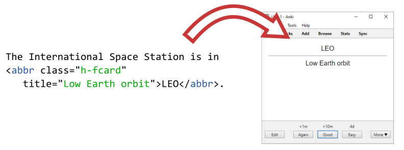

files2flashcards
================

`files2flashcards` allows you to extract data from text files and convert it into flashcards in Anki. **Keep your flashcards rooted in the context of your notes.**

Disclaimer: Early stage of development! Make sure your backups work of both notes and flashcards!



Highlights
----------

* Specify flashcards using XML / HTML
* Update your notes and see the changes reflected in existing flashcards
* Flexible and configurable specification of flashcards including cloze deletions; design your own formats
* See and edit your flashcards in context with other flashcards and notes
* Written in Python and well-tested
* Free and open-source software

Example usage and behavior
--------------------------

_Note: You need AnkiConnect installed to use this. It has been tested with Python&nbsp;3.7._

A flashcard for abbreviations might be specified as this:

```HTML
<abbr class="h-fcard" title="Low Earth Orbit">LEO</abbr>
```

A _mapping function_ is then used to extract the content from the HTML element and return a dictionary of field for Anki. This function is passed an `ElementTree` object.

```python
def extract_abbreviation_basic(root):
    """Simple function for extracting abbreviation data"""

    return {"Back": root.attrib["title"], "Front": root.text}
```

This mapping function is then added to `files2flashcards`:

```python
f2f.add_format(
    tag="abbr",
    class_name="h-fcard",
    note_type="Basic",
    mapping_function=extract_abbreviation_basic)
```

Here we specify that the HTML tag is `abbr` and the class `h-fcard` must be present. The note type is `Basic` and finally the mapping function is supplied. Additional formats can be added and any tag, class, note type and mapping function can in principle be used -- full flexibility!

To run `files2flashcards` you currently need to make a Python script to call the module. The following should give the basic principle:

```python
import files2flashcards as f2f

# Select which deck is to be used
f2f.AnkiConnectWrapper.deck_name = "Default"

# Write your mapping function
def extract_abbreviation_basic(root):
    """Simple function for extracting abbreviation data"""

    return {"Back": root.attrib["title"], "Front": root.text}

# Add the format so `files2flashcards`
f2f.add_format(
    tag="abbr",
    class_name="h-fcard",
    note_type="Abbreviation",
    mapping_function=extract_abbreviation_basic)

# Process all markdown files in the `notes` directory
f2f.process_folder("./notes/", regex=r'md$')
```

`files2flashcards` will edit your notes and insert the note ID from Anki into your notes again.

```HTML
<abbr class="h-fcard" title="Low Earth Orbit" data-anki-id="13245">LEO</abbr>
```

This is used for updating notes. If the content of the above element is edited, then `files2flashcards` will update the corresponding note in Anki.

Cloze deletions
---------------

Cloze deletions are supported using the `extract_cloze` function. In notes, a cloze is specified as the following:

```HTML
<abbr class="h-fcard e-cloze"><em>This</em> is a <em>cloze</em></abbr>
```

The `em`-tags are interpreted as the cloze deletions.

Like all other flashcards generated with `files2flashcards`, the implementation is stable. Updating the definition of the cloze deletion updates the flashcards in Anki. Adding new cloze deletions preserves learning progress on all existing clozes. This is done by inserting the cloze's ID into the note, in a similar manner as the note IDs are stored.

_How can I help?_ / Contributing
------------------------------

Contributions are welcome, in all kinds:

* Telling your friends
* Suggest features
* Submit bug reports
* Documentation
* Fix bugs
* Implement new features
* Something I didn't think of!

Please also consult the project goals below.

Project goals
-------------

The goal of this project is to give a richer connection between text files and flashcards. Especially in relation to notes where flashcard data might be embedded.

This is sought to be achieved in two ways:

1. Parsing data from files and mapping to flashcards
2. Interfacing with flashcard software so the flashcards can be added

### Non-goals

#### Implement flashcard / spaced-repetition software

Anki, Mnemosyne and others already implement this excellently.

Dream features
--------------

* Command line arguments
* Dry run mode
* Configuration files
* Accessible in package managers
* Multithreaded processing
* Performance evaluation
* Error handling
* Logging
* Support for adding media to Anki
* Support for other formats of flashcard data (something else than XML)
* Support for other flashcard apps
* Daemon / autorun
* Documentation
* Design documentation
* Testing with hypothesis
* More build in note types
* Example uses
